# CI/CD Setup Documentation

## Overview

This repository now has a **complete GitHub Actions CI/CD pipeline** with automated testing, linting, security scanning, and deployment.

---

## 🔄 GitHub Actions Workflows

### 1. **CI Pipeline** (`.github/workflows/ci.yml`)

**Triggers:**
- Push to `main`, `develop`, or any `claude/**` branch
- Pull requests to `main` or `develop`

**Jobs:**

#### 🐍 Backend Tests & Linting
- **Black** - Code formatting check
- **Flake8** - Linting (PEP 8 compliance)
- **MyPy** - Type checking
- **Pytest** - Unit tests with coverage reports
- **Codecov** - Upload coverage to codecov.io

#### ⚛️ Frontend Tests & Linting
- **ESLint** - JavaScript/TypeScript linting
- **TypeScript** - Type checking (`tsc --noEmit`)
- **Build** - Production build verification
- **Tests** - Frontend unit tests (if configured)

#### 🔒 Security Scanning
- **Trivy** - Vulnerability scanner for dependencies
- **TruffleHog** - Secret detection in code
- **SARIF** - Upload results to GitHub Security tab

#### 🐳 Docker Build Test
- Build Docker image to verify Dockerfile works
- Use GitHub Actions cache for faster builds

#### 🗄️ Database Migration Validation
- Validate SQL syntax
- Check migration naming convention (`###_description.sql`)

#### ✅ CI Status Report
- Aggregate results from all jobs
- Fail if critical jobs fail

---

### 2. **Deployment Pipeline** (`.github/workflows/deploy.yml`)

**Triggers:**
- Push to `main` branch
- Manual trigger via `workflow_dispatch`

**Jobs:**

#### 🏗️ Build & Push Docker Image
- Build multi-stage Docker image
- Push to Docker Hub with tags:
  - `latest` (for main branch)
  - `<branch>-<sha>` (for tracking)
- Use GitHub Actions cache for faster builds

#### 🗄️ Run Database Migrations
- Install Supabase CLI
- Link to Supabase project
- Push migrations: `supabase db push`

#### 🚀 Deploy to Railway
- Install Railway CLI
- Deploy using `railway up`
- Automatically deploys to production

#### 🏥 Health Check
- Wait 30 seconds for deployment
- Check API health endpoint
- Run smoke tests (chat API)

#### 📊 Deployment Status Report
- Aggregate deployment results
- Notify team via Slack (optional)

---

### 3. **Daily Recipe Scraper** (`.github/workflows/daily_recipe_scraper.yml`)

**Triggers:**
- Scheduled: 2 AM UTC daily (`cron: '0 2 * * *'`)
- Manual trigger

**Jobs:**
- Scrape recipes from free APIs
- Generate embeddings for new recipes
- Update Supabase database

---

## 🧪 Testing Setup

### Backend Tests (`backend/tests/`)

**Test Files:**
- `test_dietary_compatibility.py` - Tests for Non-Veg + Low Carb logic
- `test_nutrition_extraction.py` - Tests for nutrition data extraction
- `test_api_endpoints.py` - Tests for FastAPI endpoints

**Run tests locally:**
```bash
cd backend
pytest tests/ -v --cov=. --cov-report=html
```

**View coverage:**
```bash
open htmlcov/index.html  # macOS
xdg-open htmlcov/index.html  # Linux
```

---

### Configuration Files

**`backend/pytest.ini`**
- Pytest configuration
- Test discovery patterns
- Coverage settings

**`backend/.flake8`**
- Flake8 linting rules
- Line length: 120
- Excludes: venv, __pycache__, dist

**`backend/pyproject.toml`**
- Black formatter settings
- MyPy type checking config

---

## 🔐 Required GitHub Secrets

Add these secrets to your GitHub repository settings:

### **Database**
- `SUPABASE_URL` - Your Supabase project URL
- `SUPABASE_KEY` - Supabase anon/public key
- `SUPABASE_DATABASE_URL` - PostgreSQL connection string
- `SUPABASE_ACCESS_TOKEN` - Supabase CLI access token
- `SUPABASE_DB_PASSWORD` - Database password
- `SUPABASE_PROJECT_ID` - Supabase project ID

### **API Keys**
- `GEMINI_API_KEY` - Google Gemini API key
- `GROQ_API_KEY` - Groq API key (optional)

### **Deployment**
- `DOCKERHUB_USERNAME` - Docker Hub username
- `DOCKERHUB_TOKEN` - Docker Hub access token
- `RAILWAY_TOKEN` - Railway deployment token

### **Notifications (Optional)**
- `SLACK_WEBHOOK` - Slack webhook URL for notifications

---

## 📝 How to Set GitHub Secrets

1. Go to your repository on GitHub
2. Settings → Secrets and variables → Actions
3. Click "New repository secret"
4. Add each secret with its value

---

## 🚀 Deployment Flow

### Automatic Deployment (Main Branch)

```mermaid
graph LR
    A[Push to main] --> B[CI Pipeline]
    B --> C{Tests Pass?}
    C -->|Yes| D[Build Docker Image]
    C -->|No| E[❌ Block Deployment]
    D --> F[Push to Docker Hub]
    F --> G[Run Migrations]
    G --> H[Deploy to Railway]
    H --> I[Health Check]
    I --> J{Healthy?}
    J -->|Yes| K[✅ Deployment Success]
    J -->|No| L[❌ Rollback]
```



### Feature Branch Development

```
feature-branch → CI Pipeline → Tests → Code Review → Merge to main → Auto Deploy
```

---

## 🛠️ Local Development Workflow

### 1. **Create Feature Branch**
```bash
git checkout -b feature/my-feature
```

### 2. **Make Changes & Test**
```bash
# Backend
cd backend
pytest tests/ -v
black .
flake8 .

# Frontend
cd ../frontend
npm run lint
npm run build
```

### 3. **Commit & Push**
```bash
git add .
git commit -m "feat: add new feature"
git push origin feature/my-feature
```

### 4. **Create Pull Request**
- GitHub Actions will automatically run CI pipeline
- Review test results
- Merge when all checks pass

### 5. **Auto-Deploy**
- Merging to `main` triggers deployment pipeline
- Application automatically deploys to production

---

## 📊 Monitoring & Observability

### GitHub Actions Dashboard
- View workflow runs: https://github.com/YOUR_USERNAME/CulinaraAI/actions
- Check test results, coverage, security scans

### Codecov Dashboard
- View code coverage: https://codecov.io/gh/YOUR_USERNAME/CulinaraAI
- Track coverage trends over time

### Docker Hub
- View published images: https://hub.docker.com/r/YOUR_USERNAME/culinaraai
- Track image versions

### Supabase Dashboard
- Monitor database performance
- View migration history
- Check logs

---

## ✅ Pre-Merge Checklist

Before creating a pull request, ensure:

- [ ] All tests pass: `pytest tests/`
- [ ] Code is formatted: `black .`
- [ ] No linting errors: `flake8 .`
- [ ] Type checking passes: `mypy .`
- [ ] Frontend builds: `npm run build`
- [ ] Updated documentation (if needed)
- [ ] Added tests for new features

---

## 🔧 CI/CD Maintenance

### Adding New Tests
1. Create test file in `backend/tests/test_*.py`
2. Follow naming convention: `test_feature_name.py`
3. Use pytest fixtures and markers
4. Tests will automatically run in CI

### Updating Dependencies
1. Update `backend/requirements.txt` or `frontend/package.json`
2. Push to feature branch
3. CI will test with new dependencies
4. Merge when tests pass

### Modifying CI Pipeline
1. Edit `.github/workflows/ci.yml`
2. Test locally using [act](https://github.com/nektos/act)
3. Push and verify in GitHub Actions

---

## 🐛 Troubleshooting

### Tests Failing in CI but Pass Locally

**Cause:** Environment differences

**Solution:**
```bash
# Use exact Python version as CI
pyenv install 3.11
pyenv local 3.11

# Clear cache
rm -rf .pytest_cache __pycache__
pip install -r requirements.txt --force-reinstall
```

### Docker Build Fails

**Cause:** Missing dependencies or wrong paths

**Solution:**
```bash
# Test build locally
docker build -t culinaraai:test .
docker run -p 8080:8080 culinaraai:test

# Check logs
docker logs <container_id>
```

### Migration Fails

**Cause:** SQL syntax error or dependency issues

**Solution:**
```bash
# Validate SQL locally
psql -U postgres -c "\i supabase/migrations/002_user_preferences.sql"

# Check migration order
ls -la supabase/migrations/
```

---

## 📈 Future Enhancements

- [ ] **End-to-end tests** with Playwright
- [ ] **Performance testing** with k6
- [ ] **Load testing** in staging environment
- [ ] **Blue-green deployments** for zero downtime
- [ ] **Automated rollback** on health check failure
- [ ] **Canary releases** for gradual rollout
- [ ] **Dependency updates** with Dependabot
- [ ] **Security scanning** with Snyk
- [ ] **API documentation** generation with Swagger

---

## 📚 Resources

- [GitHub Actions Documentation](https://docs.github.com/en/actions)
- [Pytest Documentation](https://docs.pytest.org/)
- [Black Formatter](https://black.readthedocs.io/)
- [Flake8 Linting](https://flake8.pycqa.org/)
- [Docker Best Practices](https://docs.docker.com/develop/dev-best-practices/)
- [Supabase CLI](https://supabase.com/docs/guides/cli)

---

## 🎯 Summary

Your repository now has:

✅ **Automated Testing** - Backend & Frontend
✅ **Code Quality** - Linting, Formatting, Type Checking
✅ **Security** - Vulnerability & Secret Scanning
✅ **CI/CD** - Automated Build, Test, Deploy
✅ **Monitoring** - Health Checks & Status Reports
✅ **Database** - Automated Migration Running

Every push triggers CI, every merge to `main` deploys to production!
